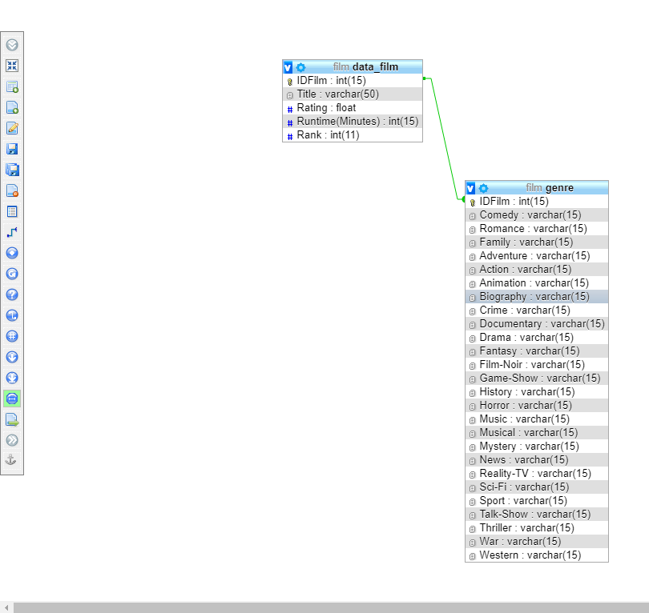

<h1 align="center">
   
  Data Storing on Top Film Based on Popularity
   
   
</h1>

# Description

DBMS Chosen : MYSQL

## Pros :
- Data security
- On-demand scalability
- Round the clock uptime
- Comprehensive transactional support
- Complete workflow control
- The flexibility of open source
- Wide adopted and easy to use
- Fast, portable, and secure

## Cons :
- Restricted for complex business logic
- Few stability  issues
- Transactions are not handled very efficiently
- The functionality tends to be heavily dependent on the addons
- Prior knowledge is a must

Why do I choose it? Because I feel more familiar to MYSQL than the other DBMS(already taught at Database course)

# Screenshots

Table Structure

Film Database

Data Film Database

Genre Database

# References

- https://www.wpblogx.com/what-is-mysql/
- MySQL on PHPMyAdmin using XAMPP

# Author
Naufal Aditya Dirgandhavi - 13517064